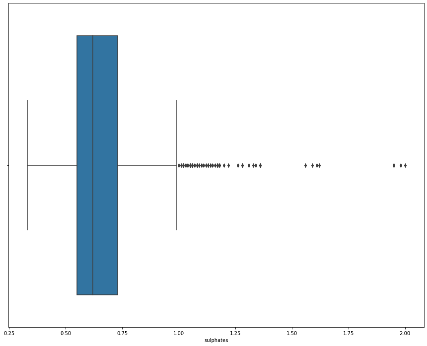

## IMPORT LIBRARIES


```python
import pandas as pd
import numpy as np
import seaborn as sns
import matplotlib.pyplot as plt
%matplotlib inline

from sklearn.model_selection import train_test_split, cross_val_score
from sklearn.ensemble import RandomForestClassifier, ExtraTreesClassifier
from sklearn.tree import DecisionTreeClassifier

from sklearn import metrics
from sklearn.metrics import confusion_matrix, accuracy_score, recall_score, precision_score, f1_score
from sklearn.preprocessing import StandardScaler, LabelEncoder

import warnings
warnings.filterwarnings("ignore")
```

## GETTING KNOW ABOUT THE DATA SET


```python
df = pd.read_csv('winequality-red.csv')
```


```python
df.head()
```


<div>
<style scoped>
    .dataframe tbody tr th:only-of-type {
        vertical-align: middle;
    }

    .dataframe tbody tr th {
        vertical-align: top;
    }

    .dataframe thead th {
        text-align: right;
    }
</style>
<table border="1" class="dataframe">
  <thead>
    <tr style="text-align: right;">
      <th></th>
      <th>fixed acidity</th>
      <th>volatile acidity</th>
      <th>citric acid</th>
      <th>residual sugar</th>
      <th>chlorides</th>
      <th>free sulfur dioxide</th>
      <th>total sulfur dioxide</th>
      <th>density</th>
      <th>pH</th>
      <th>sulphates</th>
      <th>alcohol</th>
      <th>quality</th>
    </tr>
  </thead>
  <tbody>
    <tr>
      <th>0</th>
      <td>7.4</td>
      <td>0.70</td>
      <td>0.00</td>
      <td>1.9</td>
      <td>0.076</td>
      <td>11.0</td>
      <td>34.0</td>
      <td>0.9978</td>
      <td>3.51</td>
      <td>0.56</td>
      <td>9.4</td>
      <td>5</td>
    </tr>
    <tr>
      <th>1</th>
      <td>7.8</td>
      <td>0.88</td>
      <td>0.00</td>
      <td>2.6</td>
      <td>0.098</td>
      <td>25.0</td>
      <td>67.0</td>
      <td>0.9968</td>
      <td>3.20</td>
      <td>0.68</td>
      <td>9.8</td>
      <td>5</td>
    </tr>
    <tr>
      <th>2</th>
      <td>7.8</td>
      <td>0.76</td>
      <td>0.04</td>
      <td>2.3</td>
      <td>0.092</td>
      <td>15.0</td>
      <td>54.0</td>
      <td>0.9970</td>
      <td>3.26</td>
      <td>0.65</td>
      <td>9.8</td>
      <td>5</td>
    </tr>
    <tr>
      <th>3</th>
      <td>11.2</td>
      <td>0.28</td>
      <td>0.56</td>
      <td>1.9</td>
      <td>0.075</td>
      <td>17.0</td>
      <td>60.0</td>
      <td>0.9980</td>
      <td>3.16</td>
      <td>0.58</td>
      <td>9.8</td>
      <td>6</td>
    </tr>
    <tr>
      <th>4</th>
      <td>7.4</td>
      <td>0.70</td>
      <td>0.00</td>
      <td>1.9</td>
      <td>0.076</td>
      <td>11.0</td>
      <td>34.0</td>
      <td>0.9978</td>
      <td>3.51</td>
      <td>0.56</td>
      <td>9.4</td>
      <td>5</td>
    </tr>
  </tbody>
</table>
</div>


```python
df.tail()
```


<div>
<style scoped>
    .dataframe tbody tr th:only-of-type {
        vertical-align: middle;
    }

    .dataframe tbody tr th {
        vertical-align: top;
    }

    .dataframe thead th {
        text-align: right;
    }
</style>
<table border="1" class="dataframe">
  <thead>
    <tr style="text-align: right;">
      <th></th>
      <th>fixed acidity</th>
      <th>volatile acidity</th>
      <th>citric acid</th>
      <th>residual sugar</th>
      <th>chlorides</th>
      <th>free sulfur dioxide</th>
      <th>total sulfur dioxide</th>
      <th>density</th>
      <th>pH</th>
      <th>sulphates</th>
      <th>alcohol</th>
      <th>quality</th>
    </tr>
  </thead>
  <tbody>
    <tr>
      <th>1594</th>
      <td>6.2</td>
      <td>0.600</td>
      <td>0.08</td>
      <td>2.0</td>
      <td>0.090</td>
      <td>32.0</td>
      <td>44.0</td>
      <td>0.99490</td>
      <td>3.45</td>
      <td>0.58</td>
      <td>10.5</td>
      <td>5</td>
    </tr>
    <tr>
      <th>1595</th>
      <td>5.9</td>
      <td>0.550</td>
      <td>0.10</td>
      <td>2.2</td>
      <td>0.062</td>
      <td>39.0</td>
      <td>51.0</td>
      <td>0.99512</td>
      <td>3.52</td>
      <td>0.76</td>
      <td>11.2</td>
      <td>6</td>
    </tr>
    <tr>
      <th>1596</th>
      <td>6.3</td>
      <td>0.510</td>
      <td>0.13</td>
      <td>2.3</td>
      <td>0.076</td>
      <td>29.0</td>
      <td>40.0</td>
      <td>0.99574</td>
      <td>3.42</td>
      <td>0.75</td>
      <td>11.0</td>
      <td>6</td>
    </tr>
    <tr>
      <th>1597</th>
      <td>5.9</td>
      <td>0.645</td>
      <td>0.12</td>
      <td>2.0</td>
      <td>0.075</td>
      <td>32.0</td>
      <td>44.0</td>
      <td>0.99547</td>
      <td>3.57</td>
      <td>0.71</td>
      <td>10.2</td>
      <td>5</td>
    </tr>
    <tr>
      <th>1598</th>
      <td>6.0</td>
      <td>0.310</td>
      <td>0.47</td>
      <td>3.6</td>
      <td>0.067</td>
      <td>18.0</td>
      <td>42.0</td>
      <td>0.99549</td>
      <td>3.39</td>
      <td>0.66</td>
      <td>11.0</td>
      <td>6</td>
    </tr>
  </tbody>
</table>
</div>


```python
df.shape
```


    (1599, 12)


```python
df.info()
```

    <class 'pandas.core.frame.DataFrame'>
    RangeIndex: 1599 entries, 0 to 1598
    Data columns (total 12 columns):
     #   Column                Non-Null Count  Dtype  
    ---  ------                --------------  -----  
     0   fixed acidity         1599 non-null   float64
     1   volatile acidity      1599 non-null   float64
     2   citric acid           1599 non-null   float64
     3   residual sugar        1599 non-null   float64
     4   chlorides             1599 non-null   float64
     5   free sulfur dioxide   1599 non-null   float64
     6   total sulfur dioxide  1599 non-null   float64
     7   density               1599 non-null   float64
     8   pH                    1599 non-null   float64
     9   sulphates             1599 non-null   float64
     10  alcohol               1599 non-null   float64
     11  quality               1599 non-null   int64  
    dtypes: float64(11), int64(1)
    memory usage: 150.0 KB
    


```python
df.isnull().sum()
```


    fixed acidity           0
    volatile acidity        0
    citric acid             0
    residual sugar          0
    chlorides               0
    free sulfur dioxide     0
    total sulfur dioxide    0
    density                 0
    pH                      0
    sulphates               0
    alcohol                 0
    quality                 0
    dtype: int64


## DATA ANALYSIS

> ### CENTRAL TENDENCY


```python
df.describe()
```


<div>
<style scoped>
    .dataframe tbody tr th:only-of-type {
        vertical-align: middle;
    }

    .dataframe tbody tr th {
        vertical-align: top;
    }

    .dataframe thead th {
        text-align: right;
    }
</style>
<table border="1" class="dataframe">
  <thead>
    <tr style="text-align: right;">
      <th></th>
      <th>fixed acidity</th>
      <th>volatile acidity</th>
      <th>citric acid</th>
      <th>residual sugar</th>
      <th>chlorides</th>
      <th>free sulfur dioxide</th>
      <th>total sulfur dioxide</th>
      <th>density</th>
      <th>pH</th>
      <th>sulphates</th>
      <th>alcohol</th>
      <th>quality</th>
    </tr>
  </thead>
  <tbody>
    <tr>
      <th>count</th>
      <td>1599.000000</td>
      <td>1599.000000</td>
      <td>1599.000000</td>
      <td>1599.000000</td>
      <td>1599.000000</td>
      <td>1599.000000</td>
      <td>1599.000000</td>
      <td>1599.000000</td>
      <td>1599.000000</td>
      <td>1599.000000</td>
      <td>1599.000000</td>
      <td>1599.000000</td>
    </tr>
    <tr>
      <th>mean</th>
      <td>8.319637</td>
      <td>0.527821</td>
      <td>0.270976</td>
      <td>2.538806</td>
      <td>0.087467</td>
      <td>15.874922</td>
      <td>46.467792</td>
      <td>0.996747</td>
      <td>3.311113</td>
      <td>0.658149</td>
      <td>10.422983</td>
      <td>5.636023</td>
    </tr>
    <tr>
      <th>std</th>
      <td>1.741096</td>
      <td>0.179060</td>
      <td>0.194801</td>
      <td>1.409928</td>
      <td>0.047065</td>
      <td>10.460157</td>
      <td>32.895324</td>
      <td>0.001887</td>
      <td>0.154386</td>
      <td>0.169507</td>
      <td>1.065668</td>
      <td>0.807569</td>
    </tr>
    <tr>
      <th>min</th>
      <td>4.600000</td>
      <td>0.120000</td>
      <td>0.000000</td>
      <td>0.900000</td>
      <td>0.012000</td>
      <td>1.000000</td>
      <td>6.000000</td>
      <td>0.990070</td>
      <td>2.740000</td>
      <td>0.330000</td>
      <td>8.400000</td>
      <td>3.000000</td>
    </tr>
    <tr>
      <th>25%</th>
      <td>7.100000</td>
      <td>0.390000</td>
      <td>0.090000</td>
      <td>1.900000</td>
      <td>0.070000</td>
      <td>7.000000</td>
      <td>22.000000</td>
      <td>0.995600</td>
      <td>3.210000</td>
      <td>0.550000</td>
      <td>9.500000</td>
      <td>5.000000</td>
    </tr>
    <tr>
      <th>50%</th>
      <td>7.900000</td>
      <td>0.520000</td>
      <td>0.260000</td>
      <td>2.200000</td>
      <td>0.079000</td>
      <td>14.000000</td>
      <td>38.000000</td>
      <td>0.996750</td>
      <td>3.310000</td>
      <td>0.620000</td>
      <td>10.200000</td>
      <td>6.000000</td>
    </tr>
    <tr>
      <th>75%</th>
      <td>9.200000</td>
      <td>0.640000</td>
      <td>0.420000</td>
      <td>2.600000</td>
      <td>0.090000</td>
      <td>21.000000</td>
      <td>62.000000</td>
      <td>0.997835</td>
      <td>3.400000</td>
      <td>0.730000</td>
      <td>11.100000</td>
      <td>6.000000</td>
    </tr>
    <tr>
      <th>max</th>
      <td>15.900000</td>
      <td>1.580000</td>
      <td>1.000000</td>
      <td>15.500000</td>
      <td>0.611000</td>
      <td>72.000000</td>
      <td>289.000000</td>
      <td>1.003690</td>
      <td>4.010000</td>
      <td>2.000000</td>
      <td>14.900000</td>
      <td>8.000000</td>
    </tr>
  </tbody>
</table>
</div>


```python
df['quality'].value_counts()
```


    5    681
    6    638
    7    199
    4     53
    8     18
    3     10
    Name: quality, dtype: int64


```python
plt.figure(figsize=(10,8.5))
sns.countplot(df['quality'])
plt.xticks(rotation='vertical',size=15)
plt.show()
```


    

    


>### CORRELATION BETWEEN EACH FEATURES


```python
plt.figure(figsize=(15,12))
sns.heatmap(df.corr(),annot=True)
plt.show()
```


    

    


>### CHECKING OUTLIERS FOR EACH VARIABLE


```python
plt.figure(figsize=(15,12))
sns.boxplot(x=df['quality'],data=df)
plt.show()
```


    

    


```python
plt.figure(figsize=(15,12))
sns.boxplot(x=df['alcohol'],data=df)
plt.show()
```


    

    


```python
plt.figure(figsize=(15,12))
sns.boxplot(x=df['sulphates'],data=df)
plt.show()
```


    

    


```python
plt.figure(figsize=(15,12))
sns.boxplot(x=df['pH'],data=df)
plt.show()
```


    

    


```python
plt.figure(figsize=(15,12))
sns.boxplot(x=df['density'],data=df)
plt.show()
```


    

    


```python
plt.figure(figsize=(15,12))
sns.boxplot(x=df['total sulfur dioxide'],data=df)
plt.show()
```


    

    


```python
plt.figure(figsize=(15,12))
sns.boxplot(x=df['free sulfur dioxide'],data=df)
plt.show()
```


    

    


```python
plt.figure(figsize=(15,12))
sns.boxplot(x=df['chlorides'],data=df)
plt.show()
```


    

    


```python
plt.figure(figsize=(15,12))
sns.boxplot(x=df['residual sugar'],data=df)
plt.show()
```


    

    


```python
plt.figure(figsize=(15,12))
sns.boxplot(x=df['citric acid'],data=df)
plt.show()
```


    

    


```python
plt.figure(figsize=(15,12))
sns.boxplot(x=df['volatile acidity'],data=df)
plt.show()
```


    

    


```python
plt.figure(figsize=(15,12))
sns.boxplot(x=df['fixed acidity'],data=df)
plt.show()
```


    

    


>### FEATURES DISTRIBUTION TO EACH OTHER


```python
sns.pairplot(df)
```


    <seaborn.axisgrid.PairGrid at 0x1b8965b4880>


    

    


## MODEL BULDING

### PRE PROCCESSING


```python
x = df.drop(['quality'],axis=1)
y = df['quality']
```


```python
from imblearn.over_sampling import SMOTE
```


```python
os=SMOTE()
x_res,y_res = os.fit_resample(x,y)
```


```python
x_train, x_test, y_train, y_test = train_test_split(x_res,y_res, test_size=0.2, random_state=0)
```


```python
sc = StandardScaler()
x_train = sc.fit_transform(x_train)
x_test = sc.transform(x_test)
```

### DECISION TREE CLASSIFIER


```python
model = DecisionTreeClassifier(random_state=0,criterion='entropy',max_depth=None)
```


```python
model.fit(x_train,y_train)
```


    DecisionTreeClassifier(criterion='entropy', random_state=0)


```python
pred = model.predict(x_test)
```


```python
df_predict = pd.DataFrame({'Actual': y_test, 'Predicted': pred})
df_predict.head(10)
```


<div>
<style scoped>
    .dataframe tbody tr th:only-of-type {
        vertical-align: middle;
    }

    .dataframe tbody tr th {
        vertical-align: top;
    }

    .dataframe thead th {
        text-align: right;
    }
</style>
<table border="1" class="dataframe">
  <thead>
    <tr style="text-align: right;">
      <th></th>
      <th>Actual</th>
      <th>Predicted</th>
    </tr>
  </thead>
  <tbody>
    <tr>
      <th>3226</th>
      <td>7</td>
      <td>7</td>
    </tr>
    <tr>
      <th>2226</th>
      <td>3</td>
      <td>3</td>
    </tr>
    <tr>
      <th>2506</th>
      <td>4</td>
      <td>4</td>
    </tr>
    <tr>
      <th>1947</th>
      <td>3</td>
      <td>3</td>
    </tr>
    <tr>
      <th>3238</th>
      <td>7</td>
      <td>8</td>
    </tr>
    <tr>
      <th>3540</th>
      <td>8</td>
      <td>8</td>
    </tr>
    <tr>
      <th>3790</th>
      <td>8</td>
      <td>8</td>
    </tr>
    <tr>
      <th>735</th>
      <td>5</td>
      <td>5</td>
    </tr>
    <tr>
      <th>3754</th>
      <td>8</td>
      <td>8</td>
    </tr>
    <tr>
      <th>979</th>
      <td>5</td>
      <td>5</td>
    </tr>
  </tbody>
</table>
</div>


> ### MODEL EVALUATION


```python
acc_per = accuracy_score(y_test,pred)
```


```python
print('Model Accuracy : '+ str(round(acc_per*100))+'%')
```

    Model Accuracy : 79%
    

### RANDOM FOREST CLASSIFIER


```python
model2 = RandomForestClassifier(n_estimators=120,random_state=0)
```


```python
model2.fit(x_train,y_train)
```


    RandomForestClassifier(n_estimators=120, random_state=0)


```python
pred2 = model2.predict(x_test)
```


```python
df_predict2 = pd.DataFrame({'Actual': y_test, 'Predicted': pred2})
df_predict2.head(10)
```


<div>
<style scoped>
    .dataframe tbody tr th:only-of-type {
        vertical-align: middle;
    }

    .dataframe tbody tr th {
        vertical-align: top;
    }

    .dataframe thead th {
        text-align: right;
    }
</style>
<table border="1" class="dataframe">
  <thead>
    <tr style="text-align: right;">
      <th></th>
      <th>Actual</th>
      <th>Predicted</th>
    </tr>
  </thead>
  <tbody>
    <tr>
      <th>3226</th>
      <td>7</td>
      <td>7</td>
    </tr>
    <tr>
      <th>2226</th>
      <td>3</td>
      <td>3</td>
    </tr>
    <tr>
      <th>2506</th>
      <td>4</td>
      <td>4</td>
    </tr>
    <tr>
      <th>1947</th>
      <td>3</td>
      <td>3</td>
    </tr>
    <tr>
      <th>3238</th>
      <td>7</td>
      <td>7</td>
    </tr>
    <tr>
      <th>3540</th>
      <td>8</td>
      <td>8</td>
    </tr>
    <tr>
      <th>3790</th>
      <td>8</td>
      <td>8</td>
    </tr>
    <tr>
      <th>735</th>
      <td>5</td>
      <td>5</td>
    </tr>
    <tr>
      <th>3754</th>
      <td>8</td>
      <td>8</td>
    </tr>
    <tr>
      <th>979</th>
      <td>5</td>
      <td>5</td>
    </tr>
  </tbody>
</table>
</div>


> ### MODEL EVALUATION


```python
acc_per2 = accuracy_score(y_test,pred2)
```


```python
print('Model Accuracy : '+ str(round(acc_per2*100,4)))
```

    Model Accuracy : 86.7971
    


```python
cross_validation = cross_val_score(model2,x_res,y_res,cv=5)
print('Cross validations mean score ',round(np.mean(cross_validation)*100,4))
```

    Cross validations mean score  80.9103
    


```python
print("Recall Score :",recall_score(y_test, pred2, average='weighted'))
print("Percision Score :",precision_score(y_test, pred2, average='weighted'))
print("F1 Score :",f1_score(y_test, pred2, average='weighted'))
```

    Recall Score : 0.8679706601466992
    Percision Score : 0.8613716833911634
    F1 Score : 0.8626370599386749
    

### EXTRA TREES CLASSIFIER


```python
model3 = ExtraTreesClassifier(n_estimators=124,random_state=0)
model3.fit(x_train,y_train)
```


    ExtraTreesClassifier(n_estimators=124, random_state=0)


```python
pred3 = model3.predict(x_test)
```


```python
df_predict3 = pd.DataFrame({'Actual': y_test, 'Predicted': pred3})
df_predict3.head(10)
```


<div>
<style scoped>
    .dataframe tbody tr th:only-of-type {
        vertical-align: middle;
    }

    .dataframe tbody tr th {
        vertical-align: top;
    }

    .dataframe thead th {
        text-align: right;
    }
</style>
<table border="1" class="dataframe">
  <thead>
    <tr style="text-align: right;">
      <th></th>
      <th>Actual</th>
      <th>Predicted</th>
    </tr>
  </thead>
  <tbody>
    <tr>
      <th>3226</th>
      <td>7</td>
      <td>7</td>
    </tr>
    <tr>
      <th>2226</th>
      <td>3</td>
      <td>3</td>
    </tr>
    <tr>
      <th>2506</th>
      <td>4</td>
      <td>4</td>
    </tr>
    <tr>
      <th>1947</th>
      <td>3</td>
      <td>3</td>
    </tr>
    <tr>
      <th>3238</th>
      <td>7</td>
      <td>7</td>
    </tr>
    <tr>
      <th>3540</th>
      <td>8</td>
      <td>8</td>
    </tr>
    <tr>
      <th>3790</th>
      <td>8</td>
      <td>8</td>
    </tr>
    <tr>
      <th>735</th>
      <td>5</td>
      <td>5</td>
    </tr>
    <tr>
      <th>3754</th>
      <td>8</td>
      <td>8</td>
    </tr>
    <tr>
      <th>979</th>
      <td>5</td>
      <td>5</td>
    </tr>
  </tbody>
</table>
</div>


> ### MODEL EVALUATION


```python
acc_per3 = accuracy_score(y_test,pred3)
print('Model Accuracy : '+ str(round(acc_per3*100,4)))
```

    Model Accuracy : 87.8973
    


```python
cross_validation2 = cross_val_score(model3,x_res,y_res,cv=5)
print('Cross validations mean score ',round(np.mean(cross_validation2)*100,4))
```

    Cross validations mean score  82.0115
    

# CONCLUSION

>According to the above results Extra Tress Classifier modle has the highest accuracy (88%) & Cross validation mean score (82%)


```python

```
